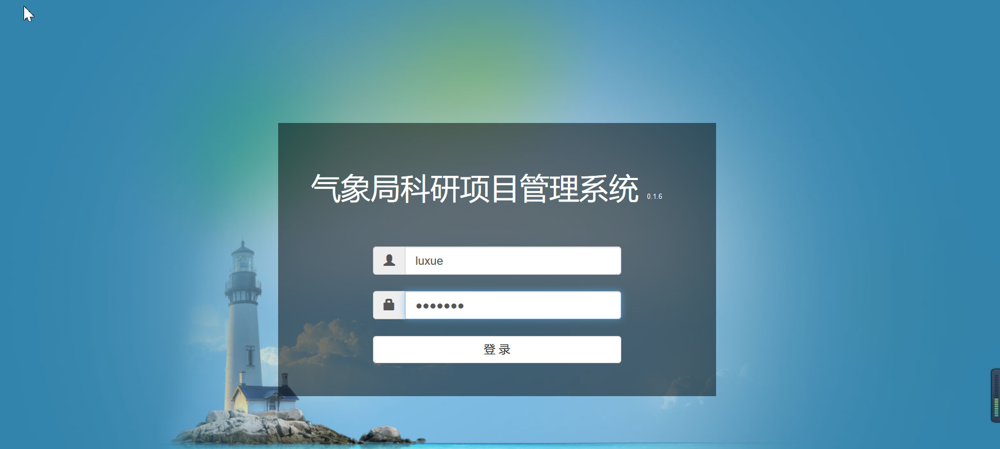
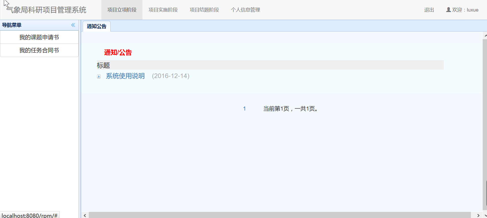
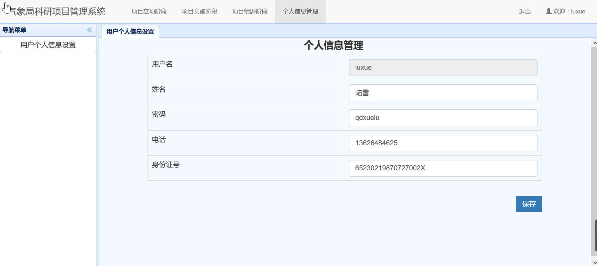

## 1.1 登录
　　项目申请人打开“科研管理系统”主页，显示如下登录页面：

　　登录成功后，显示如下系统主界面：

　　通过点击屏幕上方的导航条，可以进入对应的项目立项、项目实施、项目结题和个人信息管理模块。
　　第一次登录系统后，请首先点击`个人信息管理`模块，并点击左边的`用户个人信息设置`后，修改个人信息。修改完成后，点击保存即可，如下图所示。***注意：填报课题申报书之前必须先完善用户个人信息，否则无法进行新建申报项目。***

